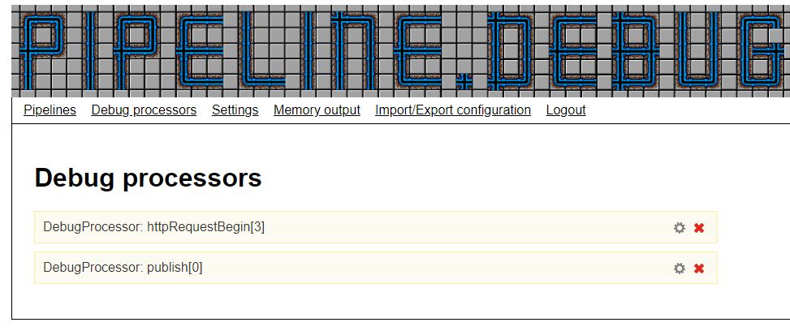
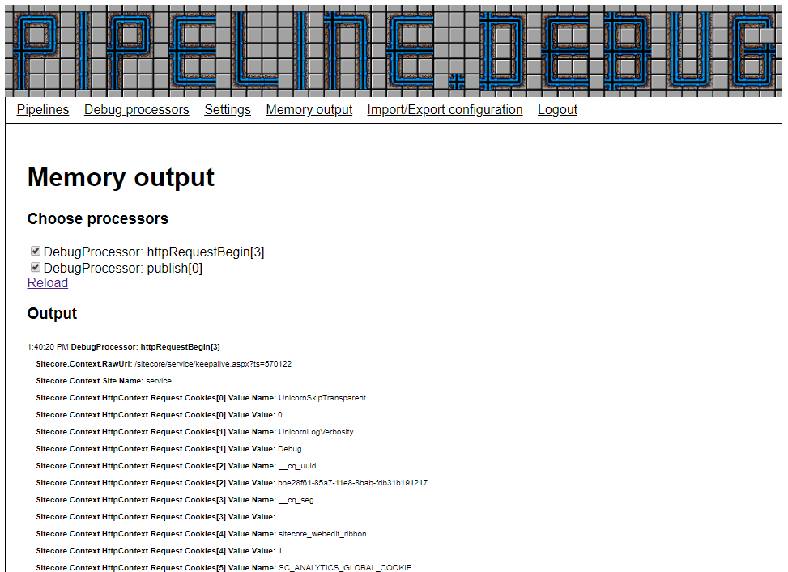
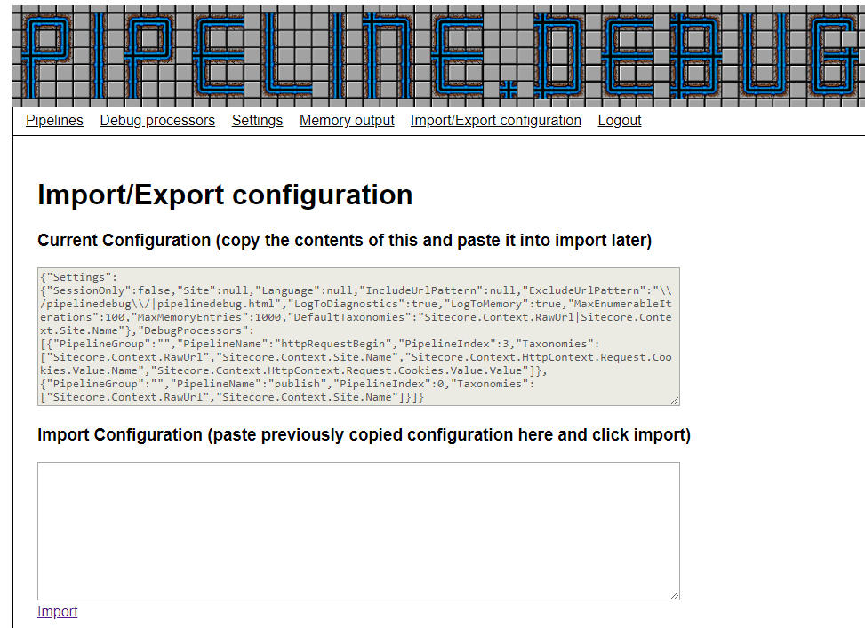

# pipeline.debug

pipeline.debug is a tool for debugging Sitecore pipelines. Once it's deployed on a server, you can add debugprocessors to any Sitecore pipeline in runtime. These debugprocessors can be configured to output properties and fields from the pipeline's arguments and Sitecore.Context. It's tested on Sitecore 8.2 and Sitecore 9.0.

The tool is intended for Sitecore developers with basic knowledge of the Sitecore Pipeline architecture and reflection of Sitecore's code in order to debug complex bugs.

Installation can happen by cloning this repository and building. After build run "copy release.bat" and the files will be added to a release folder and is ready to be copied to the server. I will add it as a module to the Sitecore Marketplace and Nuget soon as well.

After installation, simply go to [scheme]://[host]/sitecore/admin/pipelinedebug.html and you can start setting up your debugging session. It requires the user to be a Sitecore Administrator, it will prompt you to login if you are not (In Sitecore 9+, just accessing /sitecore/admin/* requires admin login).

## Adding processors to a pipeline

Go to the Pipelines window to add new debugprocessors (or move existing). Simply choose the pipeline you wish to add a new debugprocessor to. Then you can drag and drop debugprocessors to a given spot in the pipeline.

In the below example we add a debugprocessor to the httpRequestBegin pipeline.

You can add multiple processors to a pipeline, as well as adding processors to multiple pipelines.

## Setting up which values to output

Each configured debugprocessor has an icon to open the edit overlay. This overlay lets you decide which values you wish to output from the pipelines arguments and Sitecore.Context. At the top the currently selected values are shown. A newly added processor will automatically have the default taxonomies that are defined under the Settings window. You can add additional taxonomies either by writing them in the textboxes (once selected, a new textbox will pop up), or by using the discovery feature at the bottom. 

In the below example I have chosen to output the cookies of the request in my httpRequestBegin pipeline.

The discovery uses reflection to find all properties and fields (public or private) of the given types. The list is however not necessarily exhaustive since we can only find the members of the declared types and not the concrete types in cases of inheritance. This is for instance clearly displayed when using the Sitecore Commerce ServicePipelineArgs, where the ServiceProviderRequest and ServiceProviderResult are always inherited classes with context-specific members. This problem only exists at discovery time. When the debugprocessor is run, it will reflect the runtime type, and all members will be found. This means that any valid taxonomies added via the textboxes, will work - this however requires you to do some reflection on your own, in order to find the taxonomies.

In case the debugprocessor encounters null values or empty enumerables "on its way" to a given taxonomy, it prints that the value is null and continues.

## Managing configured processors

The Debug Processors window gives an overview of all active processors. Here you can easily edit or remove each processor.

## Managing the settings

The settings window allows you to add global constraints to debugprocessors, setup logging details and setting default taxonomies for new debugprocessors. 

All settings are read on startup from the PipelineDebug.config file. If you prefer other defaults, set them here.

### Setting constraints

Below I describe the constraint possibilities of the settings. Common for all of them is that empty/unchecked value adds no constraints.

* **Only output from current session** - checkbox. If checked, only requests from the current browsers session (the last browser to clicks the Save button) will be logged.
* **Site constraint** - sitename. Will only log if the Sitecore.Context.Site.Name matches the given sitename.
* **Language constraint** - languagename. Will only log if the Sitecore.Context.Language.Name matches the given languagename.
* **Include url** - regular expression. Will only log requests that match the given url to be logged.
* **Exclude url** - regular expression. Will filter out any requests on urls that matches the setting. By default the pipelinedebug requests is filtered.

### Output settings

By default all output will be logged both to file and memory. The file logger is defined in the PipelineDebug.config file.

To ensure that PipelineDebug does not end up in an OutOfMemoryException, there are constraints on amount of log entries as well as how many iterations of enumerables will be done. Depending on need of logging and memory on the server, these can be changed, but if you need very large datasets, I recommend you to go with the filelogging.

### Default taxonomies

Whenever a new debugprocessor is added, it's given the taxonomies set in "Default Taxonomies". The standard setting is *request url* and *site name*.

## Memory output

The Memory output window allows you to see the output from all processors. As of now you can only filter on processor type. Additional dynamic filters might be added in the future.

The formatting of the output isn't much to talk about as of now. It's just a timestamp and which processor, followed by the values of all the selected taxonomies. I've considered many things such as adding functionality for toggling the logs, adding more distinct formatting. But I really find that the best solution can vary depending on the selected data and the amount of logs. Any input on how to improve this is very welcome. Look me up @morten.engel on the Sitecore Slack channel. 

## Importing and exporting configuration

The tool is designed as runtime only. If you want permanent logging in pipelines, you should create and configure the according processor (It wouldn't be hard to expand functionality to autoload an entire configuration, but real logging should be made in real processors). However sometimes you might want to be able to recreate the same setup easily. Once you're done with your configuration, just go to the Import/Export configuration window, and copy the JSON value from the Current Configuration textarea. Next time you want to create (or reset) to this configuration. Simply paste it to the Import Configuration textarea, and click Import.

## A word of caution

While the tool is limited to outputting values of fields and properties, it's not without risk. Consider for instance a lazy property "B" that uses the value of "A" first get. If you add a debugprocessor before "A" is set, and output "B", "B" will have the wrong value, not just for your own debugging output, but any following uses. If you're unsure what a property does, at least test the processor on a non-production environment before running it on production.

## Changing the UI

I'm not much of a frontender, I know. If you want to change something, feel free to change it in the html/js/css files included. If you're changing it for the better, you're welcome to make a merge request on a fork (but don't make it in some frontend framework that I'll have to learn to edit in myself).

## Extending functionality

Most of the coding is made by services setup via IOC in the PipelineDebug.config file. Most improvements shouldn't be hard to implement, either by extending and configuring, or by simply cloning the repository and coding the wanted changes. If you make something that would be useful to others I would love to hear about it. Create a fork and a merge request, or look me up on Sitecore Slack @morten.engel

